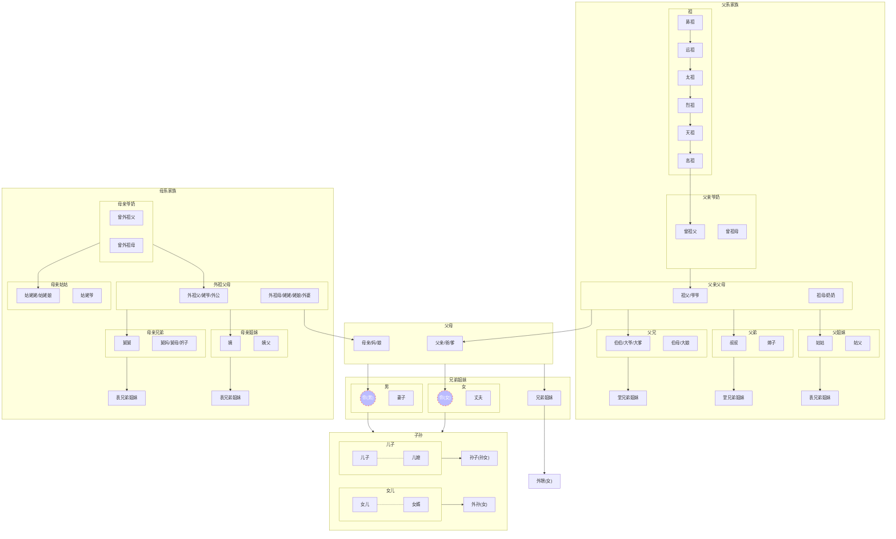

---
Title | 杂项 家族关系图
-- | --
Created @ | `2023-01-25T14:28:18Z`
Updated @| `2023-01-26T07:43:02Z`
Labels | ``
Edit @| [here](https://github.com/junxnone/wiki/issues/100)

---

## Mermaid code

```mermaid


graph TD
    classDef someclass fill:#bbf,stroke:#f66,stroke-width:2px,color:#fff,stroke-dasharray: 5 5

    subgraph 父母
        Y[父亲/爸/爹]
        X[母亲/妈/娘]
    end

    subgraph 兄弟姐妹
        subgraph 男
            direction LR
            A(("你(男)")):::someclass
            AX[妻子]
        end
        subgraph 女
            M(("你(女)")):::someclass
            MY[丈夫]
        end
        N[兄弟姐妹]
    end
    父母 --> A
    父母 --> M
    父母 --> N

    subgraph 子孙
        subgraph 儿子
            direction LR
            B[儿子]
            BX[儿媳]
            B -.- BX
        end
        儿子 --> BB["孙子(孙女)"]
        subgraph 女儿
            direction LR
            C[女儿]
            CY[女婿]
            C -.- CY
        end
        女儿 --> CC["外孙(女)"]
    end
    女 --> 子孙
    男 --> 子孙
    N --> MBX["外甥(女)"]


    subgraph 父系家族
        subgraph 父亲父母
            YY[祖父/爷爷] 
            YX[祖母/奶奶]
        end
        父亲父母 --> Y

        subgraph 父兄
            Y1[伯伯/大爷/大爹]
            Y1Y[伯母/大娘]
        end
        父亲父母 --> Y1
        父兄 --> Y11[堂兄弟姐妹]

        subgraph 父弟
            Y2[叔叔]
            Y2Y[婶子]
        end
        父亲父母 --> Y2
        父弟 --> Y21[堂兄弟姐妹]

        subgraph 父姐妹
            Y3[姑姑]
            Y3Y[姑父]
        end
        父姐妹 --> Y31[表兄弟姐妹]
        父亲父母 --> Y3

        subgraph 父亲爷奶
            YY1[曾祖父]
            YY1X[曾祖母]
        end
        父亲爷奶 --> YY

        subgraph 祖
            YY2[高祖]
            YY3[天祖]
            YY4[烈祖]
            YY5[太祖]
            YY6[远祖]
            YY7[鼻祖]
            YY7 --> YY6 --> YY5 --> YY4 --> YY3 --> YY2--> YY1
        end
    end
    
    subgraph 母系家族
        subgraph 外祖父母
            XY[外祖父/姥爷/外公]
            XX[外祖母/姥姥/姥娘/外婆]
        end

        subgraph 母亲姐妹
            X2[姨]
            X2Y[姨父]
        end
        母亲姐妹 --> X21[表兄弟姐妹]

        subgraph 母亲兄弟
            X1[舅舅]
            X1X[舅妈/舅母/妗子]
        end
        母亲兄弟 --> X11[表兄弟姐妹]
        外祖父母 --> X1
        外祖父母 --> X2
        外祖父母 --> X
        subgraph 母亲爷奶
            XX0[曾外祖父]
            XX0X[曾外祖母]
        end
        subgraph 母亲姑姑
            XX1[姑姥姥/姑姥娘]
            XX1Y[姑姥爷]
        end
        母亲爷奶 --> XX1
        母亲爷奶 --> XY

    end
    


```
