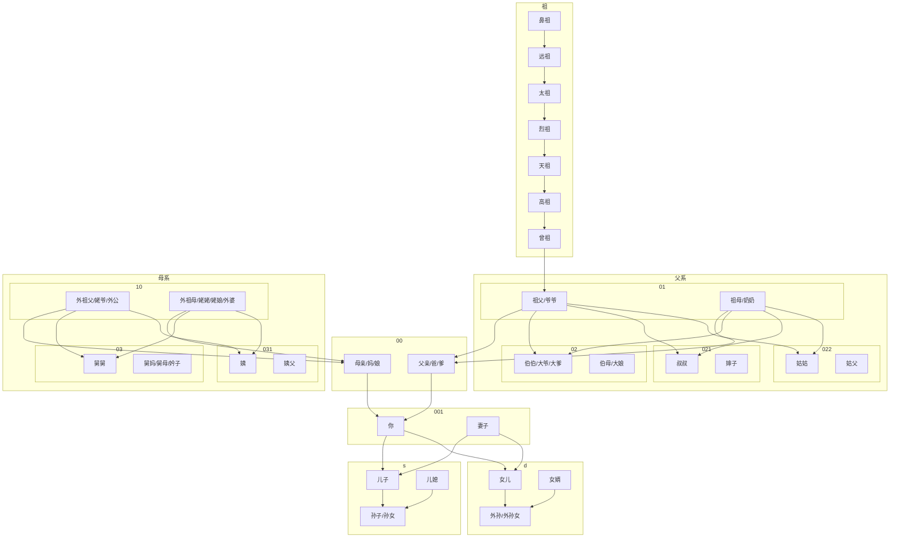

---
Title | 杂项 家族关系图
-- | --
Created @ | `2023-01-25T14:28:18Z`
Updated @| `2023-01-25T14:28:18Z`
Labels | ``
Edit @| [here](https://github.com/junxnone/wiki/issues/100)

---

```mermaid
graph TD

    subgraph 001
    A[你]
    AX[妻子]
    end


    subgraph 00
    Y[父亲/爸/爹] --> A
    X[母亲/妈/娘] --> A
    end

    subgraph 父系
    subgraph 01
    YY[祖父/爷爷] --> Y
    YX[祖母/奶奶] --> Y
    end

    subgraph 02
    YY --> Y1[伯伯/大爷/大爹]
    YX --> Y1
    Y1Y[伯母/大娘]
    end
    subgraph 021
    YY --> Y2[叔叔]
    YX --> Y2
    Y2Y[婶子]
    end
    subgraph 022
    YY --> Y3[姑姑]
    YX --> Y3
    Y3Y[姑父]
    end
    end
    
    subgraph 母系
    subgraph 10
    XY[外祖父/姥爷/外公] --> X
    XX[外祖母/姥姥/姥娘/外婆] --> X
    end
    subgraph 03
    XY --> X1[舅舅]
    XX --> X1
    X1X[舅妈/舅母/妗子]
    end
    subgraph 031
    XY --> X2[姨]
    XX --> X2
    X2Y[姨父]
    end
    end

    subgraph 祖
    YY1[曾祖]
    YY2[高祖]
    YY3[天祖]
    YY4[烈祖]
    YY5[太祖]
    YY6[远祖]
    YY7[鼻祖]
    YY7 --> YY6 --> YY5 --> YY4 --> YY3 --> YY2--> YY1 --> YY
    end


    subgraph s
    A[你] --> B[儿子]
    AX[妻子] --> B
    BX[儿媳] --> BB[孙子/孙女]
    B --> BB
    
    end

    subgraph d
    A[你] --> C[女儿]
    AX[妻子] --> C
    CY[女婿] --> CC[外孙/外孙女]
    C --> CC
    end
```
