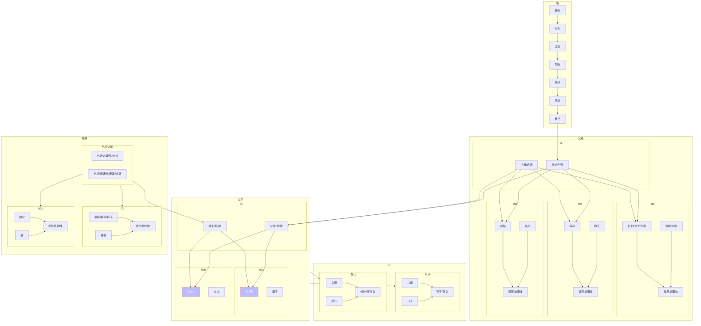

---
Title | 杂项 家族关系图
-- | --
Created @ | `2023-01-25T14:28:18Z`
Updated @| `2023-01-25T15:38:16Z`
Labels | ``
Edit @| [here](https://github.com/junxnone/wiki/issues/100)

---

```mermaid

graph TD

    subgraph 父子
    classDef someclass fill:#bbf,stroke:#f66,stroke-width:2px,color:#fff,stroke-dasharray: 5 5
    subgraph 001
    A["你(男)"]:::someclass
    AX[妻子]
    end

    subgraph 000
    M["你(女)"]:::someclass
    MY[丈夫]
    end


    subgraph 00
    Y[父亲/爸/爹] --> A
    X[母亲/妈/娘] --> A
    Y --> M
    X --> M
    end
    end


    subgraph 儿子
    B[儿子]
    BX[儿媳] --> BB[孙子/孙女]
    B --> BB
    end
    父子 --> 儿子
    subgraph 女儿
    C[女儿]
    CY[女婿] --> CC[外孙/外孙女]
    C --> CC
    end
    父子 --> 女儿

    subgraph nn
    儿子
    女儿
    end

    subgraph 父系
    subgraph 01
    YY[祖父/爷爷] --> Y
    YX[祖母/奶奶] --> Y
    end

    subgraph 02
    YY --> Y1[伯伯/大爷/大爹]
    YX --> Y1
    Y1Y[伯母/大娘] --> Y11[堂兄弟姐妹]
    Y1 --> Y11
    end
    subgraph 021
    YY --> Y2[叔叔]
    YX --> Y2
    Y2Y[婶子] --> Y21[堂兄弟姐妹]
    Y2 --> Y21
    end
    subgraph 022
    YY --> Y3[姑姑]
    YX --> Y3
    Y3Y[姑父] --> Y31[表兄弟姐妹]
    Y3 --> Y31
    end
    end
    
    subgraph 母系
    subgraph 外祖父母
    XY[外祖父/姥爷/外公]
    XX[外祖母/姥姥/姥娘/外婆]
    end
    
    subgraph 03
    X1[舅舅]
    X1X[舅妈/舅母/妗子] --> X11[表兄弟姐妹]
    X1 --> X11
    end
    外祖父母 --> 03
    
    subgraph 031
    X2[姨]
    X2Y[姨父] --> X21[表兄弟姐妹]
    X2 --> X21
    end

    外祖父母 --> 031
    end
    
    外祖父母 --> X

    subgraph 祖
    YY1[曾祖]
    YY2[高祖]
    YY3[天祖]
    YY4[烈祖]
    YY5[太祖]
    YY6[远祖]
    YY7[鼻祖]
    YY7 --> YY6 --> YY5 --> YY4 --> YY3 --> YY2--> YY1 --> YY
    end


```
